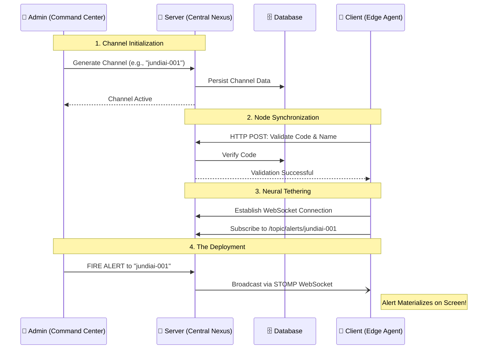

<div align="center">

# 🌌 SendBox 🌌
**The Next-Generation Instant Alerting & Communication Grid**

[](https://spring.io/projects/spring-boot)
[](https://openjfx.io/)
[](https://developer.mozilla.org/en-US/docs/Web/API/WebSockets_API)
[](https://www.mongodb.com/)

*Instantaneous. Reliable. Unstoppable.*

</div>

---

## 🛰️ Project Overview

**SendBox** is a futuristic, highly responsive, three-tier architecture designed to transmit instant visual alerts from a centralized command center directly to the screens of remote clients. Built for speed and reliability, it bypasses traditional polling mechanisms in favor of real-time, persistent neural-like connections.

---

## 🏗️ The Trinitarian Architecture

SendBox operates on a synchronized ecosystem composed of three core nodes:

1. **🧠 The Server (Central Nexus)**
   The intelligent routing core. It manages persistent connections, validates secure channel codes (e.g., `jundiai-001-region-1`), maintains the active state of all online nodes, and orchestrates the routing of critical alerts from the command center to the edge clients.

2. **👑 The Command Center (Admin Dashboard)**
   The tactical interface. A sleek frontend panel where administrators can monitor connected client nodes in real-time, generate secure channel codes, and deploy instant, system-wide alerts.

3. **👤 The Edge Agent (Client App)**
   A lightweight, stealthy background process running autonomously on the client's machine. It maintains an active tether to the Server and materializes alerts directly onto the screen (via OS-native popups or borderless windows) the millisecond they are fired.

---

## ⚡ Neural Pathways: Communication Protocol

To achieve zero-latency materialization of alerts on client screens, SendBox utilizes **WebSockets**.

- **The WebSocket Matrix:** Both the Edge Agents and the Command Center establish a persistent, bi-directional energy tether (connection) with the Central Nexus.
- **STOMP Protocol:** Messages are routed through targeted channels (topics), ensuring alerts only reach the exact nodes they are intended for.
- *Future Scalability Matrix:* The architecture is designed to seamlessly integrate a hyper-scale Message Broker (e.g., Apache Kafka or RabbitMQ) for planetary-scale deployments.

---

## 🛠️ Tech Stack: The Core Engines

### 🖥️ The Server (Backend)
- **Framework:** `Spring Boot` — The robust, industry-standard engine.
- **Real-Time Link:** `Spring WebSocket + STOMP` — High-velocity data transmission.
- **Data Vault:** `MongoDB` — NoSQL document storage for dynamic channel hierarchies, embedded client registries, and high-velocity alert logs.
- **Data Access:** `Spring Data MongoDB` — Seamless document integration.

### 💻 The Edge Agent (Client)
- **Engine:** `JavaFX` — Modern Java UI toolkit for crafting immersive, stealthy desktop experiences that run quietly in the System Tray until activated.
- **Alternative Consideration:** Electron/Tauri wrappers for web-based frontends.

### 🌐 The Command Center (Admin)
- **Interface:** A reactive Web Application (`React`, `Angular`, or server-rendered `Thymeleaf` with `Bootstrap`).

---

## 🗄️ Data Models (MongoDB)

The Central Nexus utilizes document-based NoSQL storage for maximum flexibility and performance.

### 1. Channels Collection (`canais`)
Stores the created channels and embeds the active clients connected to them.

```json
{
  "_id": "ObjectId('60f7b1b2e4b0c2a1f8e9d001')",
  "codigoCanal": "jundiai-001-region-1",
  "nomeAdmin": "Admin Central",
  "dataCriacao": "2026-06-25T21:13:00Z",
  "clientesConectados": [
    {
      "clienteId": "c1",
      "nomeCliente": "Portaria Principal",
      "status": "ONLINE",
      "ultimaConexao": "2026-06-25T21:15:00Z"
    },
    {
      "clienteId": "c2",
      "nomeCliente": "Logística - Galpão 2",
      "status": "OFFLINE",
      "ultimaConexao": "2026-06-25T18:00:00Z"
    }
  ]
}
```

### 2. Alerts Collection (`alertas`)
Maintains a historical record of all dispatches for tactical review.

```json
{
  "_id": "ObjectId('60f7b5a1e4b0c2a1f8e9d002')",
  "codigoCanal": "jundiai-001-region-1",
  "mensagem": "Atenção: Simulação de evacuação em 5 minutos!",
  "tipo": "CRITICO", 
  "destino": "TODOS",
  "dataEnvio": "2026-06-25T21:20:00Z"
}
```

---

## 🔄 The Operation Flow (Alert Lifecycle)



---
<div align="center">
<i>"Connecting the command to the edge, at the speed of light."</i>
</div>
